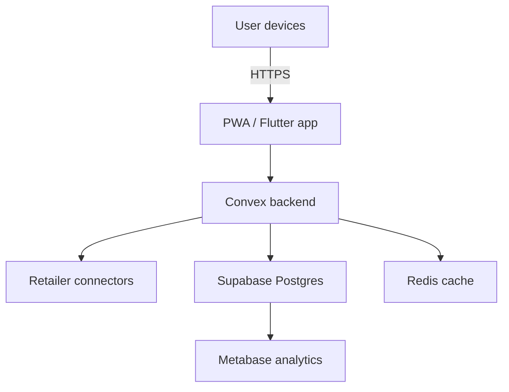

# Sweet Price

## Project snapshot

- **Value proposition**: Real-time supermarket price comparison for Portuguese shoppers.
- **Status**: Closed beta with 250 pilot households.
- **Source repository**: [`Monynha-Softwares/Sweet-Price`](https://github.com/Monynha-Softwares/Sweet-Price)
- **Primary platforms**: Web (PWA) + Android.

## Problem statement

Food inflation pressures households and small businesses. Sweet Price empowers users to compare baskets across major retailers (currently **Pingo Doce**, **Continente**, and **Auchan**) and discover promotions without sharing personal data.

## Key capabilities

- **Basket builder** — Compose shopping lists and compare total cost per retailer.
- **Dynamic promotions** — Daily ingestion of flyers and loyalty discounts.
- **Store availability** — Show in-stock indicators via retailer APIs/web scraping with caching.
- **Alerts** — Notify users when tracked items drop below custom thresholds.
- **Accessibility** — Voice search, dyslexia-friendly typefaces, and Portuguese plain-language descriptions.

## System architecture

### Technical stack

- **Frontend**: Flutter with web support, offline-first caching via Hive.
- **Backend**: Convex functions orchestrating scraping workers and Supabase REST APIs.
- **Data pipeline**: Scheduled Playwright scrapers deployed with GitHub Actions + Docker, storing normalized pricing data.
- **Analytics**: Metabase dashboards tracking savings delivered and active users.
- **Security**: Secrets stored in Doppler; connector requests routed through Cloudflare Workers to mask origin.

## Compliance & ethics

- Adheres to retailer terms by throttling requests and respecting robots.txt.
- Provides manual takedown path for retailers who opt-out.
- Handles user email addresses with GDPR-compliant consent logs.

## Deployment

| Component | Environment | Notes |
| --- | --- | --- |
| Flutter app | Play Store (Internal testing track) | Releases staged via Firebase App Distribution |
| Web PWA | Vercel | Auto deploys from `main`; service worker handles caching |
| Backend | Convex cloud | Scheduled jobs + real-time subscriptions |
| Scrapers | GitHub Actions runners | Nightly run + manual trigger from Ops |

## Roadmap

- **May 2025**: Expand coverage to Lidl and Intermarché.
- **July 2025**: Launch household budget insights dashboard.
- **October 2025**: Release open API for partner integrations (with API keys & rate limits).

## How to contribute

1. Coordinate with the Product Manager to define data-sourcing changes.
2. Provide fixtures for new retailers and update integration tests.
3. Run `flutter test` and `npm run lint:scrapers` (see repo) before opening a PR.

## Reference material

- Notion: *Sweet Price Product Requirements*
- Linear project: `SWEET` board
- Support: `#sweet-price-support` Slack channel
